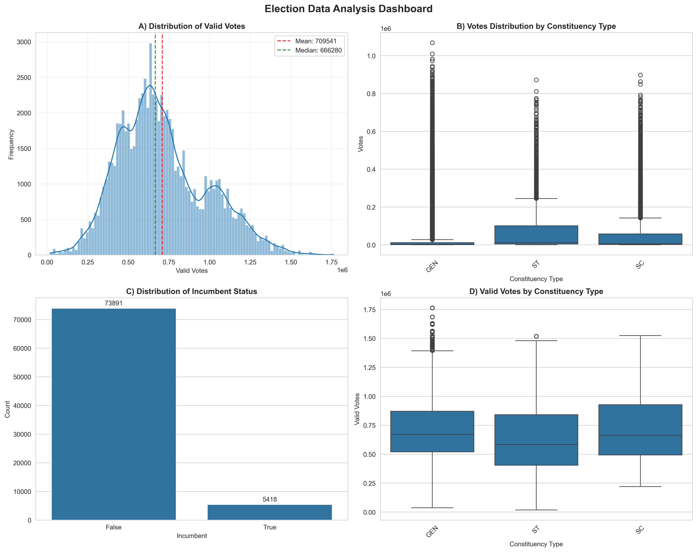
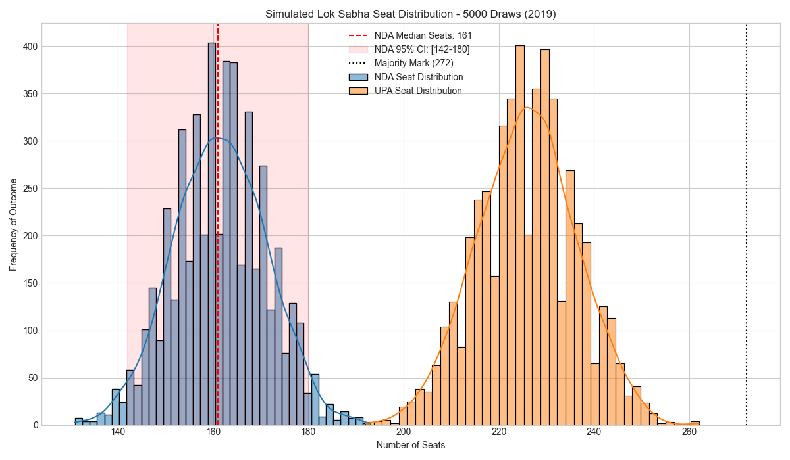
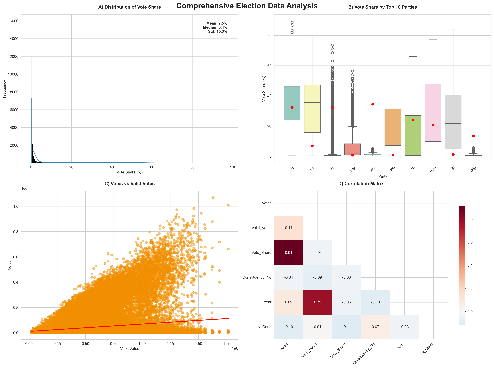

# 🇮🇳 Constituency Level Forecasting of Lok Sabha Elections


## 📊 Project Overview

This project provides a robust, data-driven framework for forecasting Indian Lok Sabha elections. It combines **Machine Learning (Ridge/Lasso Regression)** to predict vote shares at the constituency level with **Monte Carlo Simulations** to translate those shares into probabilistic seat outcomes.

The core of the project is an interactive **Streamlit Dashboard** that enables users to analyze historical trends, run real-time predictions for specific candidates, build post-poll coalitions, and generate AI-powered election reports.

---

## 🖥️ Dashboard Preview

### **Interactive Analytics Dashboard**
Explore historical data, voter turnout, and party performance across different states and constituencies.


---

## 🚀 Key Features

### 1. 📈 Comprehensive Data Analytics
* **Historical Trends (2009-2019):** Analyze party performance, incumbency effects, and voter turnout.
* **Geospatial Visualization:** Interactive choropleth maps to visualize vote shares by state and alliance.
* **Incumbency Analysis:** Compare the performance of incumbent candidates versus challengers.

### 2. 🔮 AI-Powered Prediction Engine
* **Vote Share Predictor:** Uses Ridge Regression to predict the vote share % for a candidate based on:
    * State & Constituency Type
    * Party & Alliance
    * Incumbency Status & Number of Candidates
* **Local LLM Integration:** Utilizes **Ollama** (Llama3/Mistral) to generate natural language summaries and conclusions for election reports.

### 3. 🎲 Monte Carlo Simulation
* **Stochastic Forecasting:** Runs thousands of election scenarios using **Dirichlet distributions** to account for voter volatility.
* **Seat Distribution:** Estimates win probabilities for every constituency and calculates probability intervals for national seat counts.
* **Coalition Builder:** A "What-If" tool to build custom alliances and calculate their probability of forming a majority.

### 4. 📄 Smart Reporting
* **Automated PDF Generation:** Exports comprehensive reports containing visualizations, key metrics, and AI-generated insights.

---

## 🔬 Simulation Results

### **Probabilistic Seat Distribution**
Visualize the range of possible seat outcomes for major alliances (NDA, UPA, etc.) with confidence intervals.


### **Comprehensive Analysis Reports**
Generate deep-dive analytics into specific regions or election years.


---

## 🛠️ Tech Stack

* **Language:** Python 3.8+
* **Dashboard:** Streamlit
* **Data Processing:** Pandas, NumPy, GeoPandas
* **Machine Learning:** Scikit-learn, Statsmodels, XGBoost
* **Visualization:** Plotly, Matplotlib, Seaborn
* **Simulation:** SciPy, PyMC3 (Optional)
* **Reporting:** FPDF2, Kaleido
* **GenAI:** Ollama (for local LLM inference)

---

## 📂 Project Structure

```text
├── dashboard/
│   └── app_02.py             # 🚀 Main Streamlit dashboard application
├── data/
│   ├── raw/                  # Raw election CSVs and GeoJSON files
│   └── processed/            # Cleaned datasets for modeling
├── models/
│   ├── best_ridge_model.joblib       # Trained vote share predictor
│   ├── election_simulation_model.pkl # Serialized simulation data
│   └── winners_df.pkl                # Simulation outcomes
├── notebook/
│   ├── 01_data_exploration.ipynb     # Data cleaning
│   ├── 03_feature_engineering.ipynb  # Feature creation
│   └── 05_monte_carlo_simulation.ipynb # Core simulation logic
├── report/
│   ├── election_data_dashboard.png   # Images for README
│   └── ...
├── src/
│   ├── ai_utils.py           # 🤖 Ollama integration logic
│   ├── modeling.py           # Model inference wrappers
│   └── report_generator.py   # PDF report creation
├── requirements.txt          # Project dependencies
└── README.md
````

-----

## ⚙️ Installation & Setup

### 1\. Clone the Repository

```bash
git clone [https://github.com/your-username/constituency-level-forecasting.git](https://github.com/your-username/constituency-level-forecasting.git)
cd constituency-level-forecasting
```

### 2\. Create a Virtual Environment

```bash
python -m venv venv
# Windows
venv\Scripts\activate
# Mac/Linux
source venv/bin/activate
```

### 3\. Install Dependencies

```bash
pip install -r requirements.txt
```

*Note: To support static image export for reports, ensure `kaleido` is installed correctly.*

### 4\. Setup AI (Optional)

To use the "Smart Report" AI summary features, you need [Ollama](https://ollama.com/) installed and running locally.

```bash
# Install Ollama from their website, then run:
ollama pull mistral  # or llama3
```

-----

## 🏃‍♂️ Usage

### Launching the Dashboard

To start the interactive web application:

```bash
streamlit run dashboard/app_02.py
```

Open your browser at `http://localhost:8501`.

### Updating the Simulation

If you have new data or want to retrain the simulation model:

1.  Navigate to the `notebook/` directory.
2.  Run `05_monte_carlo_simulation.ipynb` using Jupyter Lab or Notebook.
3.  This will refresh the `.pkl` files in the `models/` directory.

-----

## 🤝 Contributing

Contributions are welcome\! Please fork the repository and submit a pull request for any features, bug fixes, or documentation improvements.

1.  Fork the Project
2.  Create your Feature Branch (`git checkout -b feature/AmazingFeature`)
3.  Commit your Changes (`git commit -m 'Add some AmazingFeature'`)
4.  Push to the Branch (`git push origin feature/AmazingFeature`)
5.  Open a Pull Request

## 📝 License

Distributed under the MIT License.

```
```
